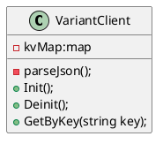

# 需求内容

要求不使用vrte接口的前提下，能够获取到对应DID相关的信息存储在sysinfo中

难点：

1. 平台化

    只有dongfeng有这个需求，不能修改VariantServer

‍

# 方案

1. 参考Exe_VariantClient来实现，打包为动态库

    不行，客户的进程还是需要链接ara com manager 动态库
2. 想方法以静态方式链接动态库

    动态库的设计本来就是为了动态链接，此路不通
3. 通过调用VariantClient 维护Json文件对信息进行缓存

    1. 通过system执行bash命令， 调用Exe_variantclient进程启动
    2. setenv设置启动的环境变量
    3. 动态库初始化的时候调用，然后读取并解析json文件
    4. kv数据存储在一个map中，供客户读取

‍

# 系统设计

## 抽象设计

### 抽象类图

‍

### **用例图**：定义功能边界（用户视角的抽象行为）。

### **部署图（Deployment Diagram）**

### 抽象包图（**Package Diagram**）

### **活动图（Activity Diagram）**

## 详细设计

### 详细类图

### 详细包图（**Package Diagram**）

* **用途**：展示代码组织的逻辑抽象（如分层、模块划分）。
* **内容**：

  * 包（命名空间）及其依赖关系。
  * 例如：`com.example.ui`​、`com.example.dao`​。

### 序列图

### 状态图
