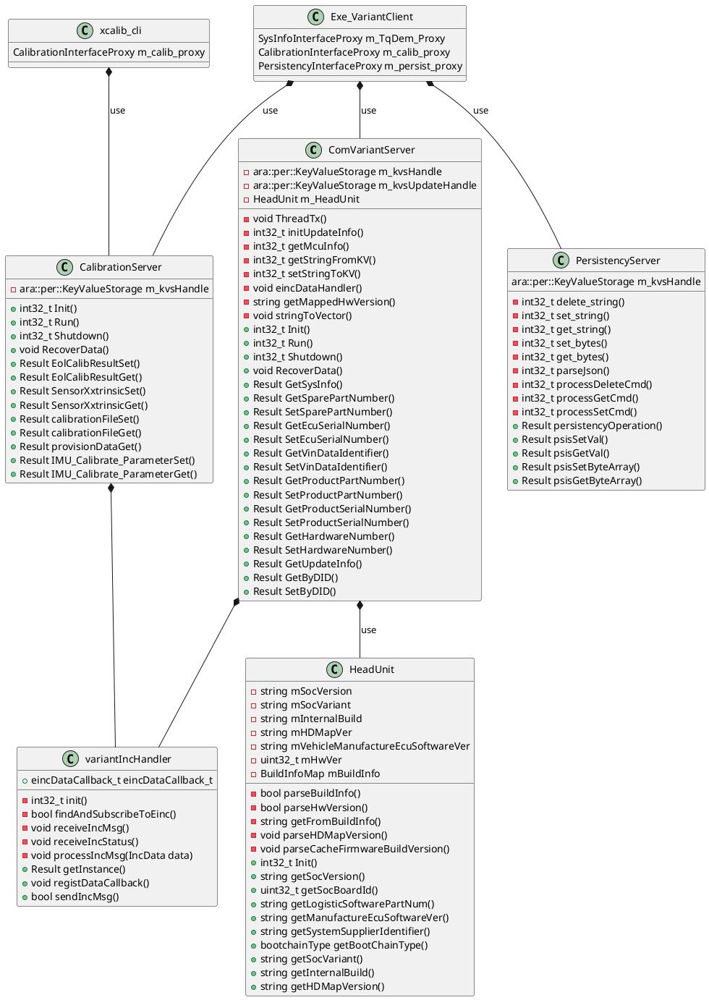

# 模块架构整理

在xc esw5 做模块开发维护工作，偷偷学习各种模块的架构以及开发流程

# VariantService

## 简介及作用

这个模块的主要作用是存储key-value键值对，需要配置持久化存储（存储位置/persist/VAR）作用很简单，平台化是有点难度的

## 架构

一图了然

![[XC-CP工作文档/assets/ArchVariantServer.svg]]

* 需要和MCU通信，用来存储mcu中的kv值，中间通过einc模块来实现，需要一个einc handler实现进程通信
* 三个子模块， 三个子模块的功能是相同的，但是面对的对象不同

  * comvariant server

    * 主要存储一些车辆系统信息sysinfo， 配置持久文件vehicleInfo
  * calibration server

    * 主要存储标定信息，持久文件 calibinfo， 主要提供给相机标定使用，会发给ararcomgateway 来转发，自动调用variant的接口
    * 存储在calibinfo中
  * persistency server

    * 主要存储车辆需要持久化存储的配置， 会发给ararcomgateway 来转发，自动调用variant的接口
    * 存储在persistinfo中

‍

# 类图设计

## 实际问题解决

[ara::core::deinit 导致的coredump](模块架构整理/ara__core__deinit%20导致的coredump.md)

[orinY variantserver启动失败问题分析](模块架构整理/orinY%20variantserver启动失败问题分析.md)

‍

# Thermal

## 简介以及功能点

## 架构描述

## 实际问题分析

‍

# logServer

## 简介以及功能点

## 架构描述

## 实际问题分析

‍

# TimeSync

## 简介以及功能点

## 架构描述

![[XC-CP工作文档/asset/Pasted image 20250430124438.png]]

![[XC-CP工作文档/asset/Pasted image 20250430124624.png]]
![[XC-CP工作文档/asset/Pasted image 20250430124650.png]]

## 实际问题分析

‍

‍

# 其他模块
