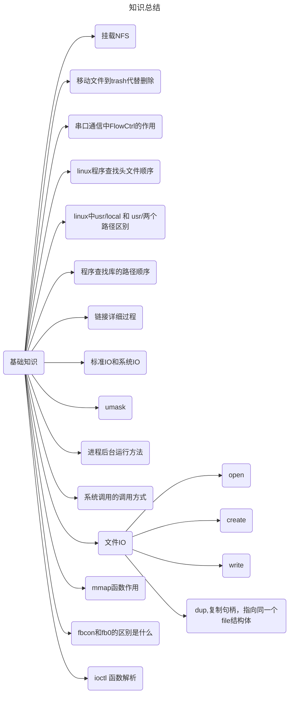

# 基础知识


## 挂载，板子中挂载服务器文件夹NFS

`mount` 命令用于挂载文件系统，使得用户能够访问存储设备上的数据。这个命令通常用于 Linux 和类 Unix 系统。以下是 `mount` 命令的基本用法和一些常见的选项：

### 基本语法
```sh
mount [选项] 设备名 挂载点
```

### 常见选项
- `-t` 或 `--types` 指定文件系统的类型。
- `-o` 或 `--options` 指定挂载选项。
- `-a` 或 `--all` 挂载 /etc/fstab 文件中列出的所有文件系统。
- `-n` 或 `--no-mtab` 不更新 /etc/mtab 文件。
- `-v` 或 `--verbose` 显示详细信息。
- `-r` 或 `--read-only` 以只读方式挂载。
- `-w` 或 `--read-write` 以读写方式挂载。

### 示例
1. **挂载一个分区到指定目录**:
   ```sh
   mount /dev/sda1 /mnt/data
   ```

2. **挂载一个 ISO 镜像文件**:
   ```sh
   mount -o loop /path/to/image.iso /mnt/cdrom
   ```

3. **挂载一个 NFS 共享**:
   ```sh
   mount -t nfs server:/share /mnt/nfs
   ```

4. **挂载一个 FAT 文件系统为只读**:
   ```sh
   mount -t vfat -o ro /dev/sdb1 /mnt/usb
   ```

5. **挂载所有文件系统**:
   ```sh
   mount -a
   ```

6. **显示挂载信息**:
   ```sh
   mount
   ```

请注意，要执行 `mount` 命令，通常需要具有管理员权限（即 root 用户权限）。如果需要挂载的文件系统在 `/etc/fstab` 文件中有定义，那么可以省略 `-t` 和 `-o` 选项。


### -o选项

在 `mount` 命令中，`-o nolock` 选项用于禁用文件锁。这个选项主要用于挂载网络文件系统（如 NFS）时，以避免在客户端之间产生文件锁竞争。

- **nolock**: 这个选项告诉系统不要为文件系统启用锁定机制。在 NFS 文件系统中，通常使用远程文件锁来保证文件的一致性和并发访问的安全性。当启用文件锁时，当一个客户端正在修改文件时，其他客户端必须等待直到锁被释放才能进行修改。
- **NFS 文件系统**: 当你挂载一个 NFS 文件系统时，通常会使用 `-o nolock` 选项来禁用远程文件锁。这是因为 NFSv3 协议默认支持文件锁，但在某些情况下，禁用这些锁可能会提高性能，尤其是在文件系统主要用于读取而不是写入的情况下。

### 注意事项

- 使用 `-o nolock` 可能会导致数据不一致的问题，尤其是在多客户端同时写入同一文件的情况下。因此，在决定是否禁用文件锁时要谨慎考虑。
- 如果你的应用不需要严格的文件一致性，或者主要进行读取操作，禁用文件锁可以提高性能。但是，在涉及频繁写入和需要文件一致性保证的应用中，禁用文件锁可能会导致问题。


## ubuntu 将文件移动到 trash中， 避免误删

### 使用命令行
如果您想要通过命令行将文件或文件夹移动到 Trash 中，可以使用 `gio` 命令。`gio` 是 GNOME 的命令行工具之一，可以用来操作文件系统和桌面环境。

#### 步骤
1. 打开终端。
2. 使用 `gio` 命令将文件或文件夹移动到 Trash。

```sh
gio trash /path/to/file_or_directory
```

这里的 `/path/to/file_or_directory` 应该替换为您想要移动到 Trash 的文件或文件夹的实际路径。

#### 示例
假设您有一个名为 `example.txt` 的文件位于 `/home/user/documents` 目录下，您想要将其移动到 Trash，可以使用以下命令：

```sh
gio trash /home/user/documents/example.txt
```


## 串口通信中Flow Conctrl 的作用

串口通信中的流控（Flow Control）是一种机制，用于管理数据传输速率，防止发送端的数据传输速度过快而导致接收端无法及时处理数据，从而造成数据丢失或溢出。流控的主要目的是确保数据的完整性和一致性。

在串行通信中，流控通常分为两种类型：

1. **硬件流控**（Hardware Flow Control）: 这种流控使用专用的控制线来实现。最常见的硬件流控有两种模式：
   - **RTS/CTS (Request to Send / Clear to Send)**: 这种模式下，发送方在开始发送数据前会先通过 RTS 信号线向接收方请求发送许可。接收方准备好接收后会通过 CTS 信号线回应，允许发送方发送数据。
   - **DSR/DTR (Data Set Ready / Data Terminal Ready)**: 这种模式下，DSR 信号线由接收方控制，用于指示其是否准备好接收数据；DTR 信号线由发送方控制，用于指示其是否准备好发送数据。
2. **软件流控**（Software Flow Control）: 这种流控不使用额外的硬件线路，而是利用特殊的数据序列来控制数据流。最常用的软件流控方式是 XON/XOFF 控制：
   - **XON/XOFF**: 在这种模式下，接收方通过发送 XOFF 字符（通常为 ASCII 字符 19）来通知发送方暂停发送数据，当接收方准备好继续接收时，会发送 XON 字符（通常为 ASCII 字符 17）来恢复数据传输。

### 流控的重要性

- **避免缓冲区溢出**：确保接收方不会因为缓冲区满而丢失数据。
- **保持数据完整性**：确保数据能够按顺序、无丢失地到达接收方。
- **提高通信效率**：合理控制数据流可以减少不必要的重传，提高整体通信效率。


## linux 中程序查找头文件的顺序

1. **内置系统路径**：
   - 编译器首先会查找其内置的系统路径。这些路径通常包括 。这些路径包含了标准库的头文件以及其他系统级别的头文件。

2. **命令行选项**：
   - 用户可以通过 `-I` 选项指定额外的搜索路径。例如：
     ```bash
     gcc -I/path/to/headers file.c
     ```
     这里的 `-I/path/to/headers` 告诉编译器也要在这个路径下查找头文件。

3. **环境变量**：
   - 用户也可以通过环境变量来影响编译器的搜索路径。例如，可以设置 `CPATH` 环境变量来添加额外的搜索路径：
     ```bash
     export CPATH=/path/to/headers
     gcc file.c
     ```
     在这种情况下，`gcc` 也会在 `/path/to/headers` 中查找头文件。

4. **相对路径**：
   - 如果头文件位于项目的某个子目录中，编译器也可能从当前文件所在的目录开始查找相对路径下的头文件。

5. **`#include <filename>`**：
   - 当使用 `<filename>` 形式的 `#include` 指令时，编译器会按照上述顺序查找头文件。

6. **`#include "filename"`**：
   - 当使用 `"filename"` 形式的 `#include` 指令时，编译器首先会在当前源文件所在目录查找头文件。如果没有找到，它会继续在内置系统路径和用户指定的路径中查找。

7. **包配置**：
   - 使用如 `pkg-config` 这样的工具可以帮助编译器找到特定库的头文件路径。例如：
     ```bash
     pkg-config --cflags libname
     ```
     这会返回类似于 `-I/path/to/libname/include` 的选项，可以将其传递给 `gcc`。

8. **编译器特定选项**：
   - 一些编译器可能还支持其他的特定选项来控制头文件的查找方式，例如 Clang 提供了 `-isystem` 选项来指定系统头文件的路径。

9. **配置文件**：
   - 有些情况下，编译器可能会读取配置文件（如 `.config` 文件）来决定头文件的查找路径。


## usr/loacal/inclde  和 usr/include 两个路径的区别是什么

在 Linux 系统中，`/usr/include` 和 `/usr/local/include` 这两个路径通常用于存放不同的类型的头文件，它们的主要区别如下：

1. **`/usr/include`**:
   - 这个目录通常由系统管理员安装操作系统时预装，或者通过包管理器安装软件包时自动创建。
   - 它包含了系统自带的标准库头文件，比如 C 标准库（libc）和其他核心库的头文件。
   - 这些头文件通常与系统紧密相关，不建议用户自行修改。
   - 一般情况下，当你使用 `gcc` 或其他编译器时，默认就会在 `/usr/include` 下查找头文件。

2. **`/usr/local/include`**:
   - 这个目录通常用于存放用户自己安装的第三方库的头文件。
   - 当你使用源码安装第三方软件时，通常会把头文件放在 `/usr/local/include` 下。
   - 这个目录允许用户自行管理自己的开发环境，不会干扰系统级的头文件。
   - 对于开发者而言，这是一个推荐放置自定义或非标准库头文件的位置。

### 使用场景示例：

- **系统标准库**：
  - 例如，当你编写 C 语言程序并使用 `<stdio.h>` 时，这个头文件通常位于 `/usr/include`。
  
- **自定义库**：
  - 如果你安装了一个第三方库，比如 Boost 库，并且希望在多个项目中使用它，你可能会将 Boost 的头文件安装到 `/usr/local/include`。

### 注意事项：

- **权限问题**：
  - 修改 `/usr/include` 通常需要 root 权限，而 `/usr/local/include` 则可以以普通用户的身份进行管理。
  
- **更新和维护**：
  - 系统更新时，`/usr/include` 下的文件可能会被替换，因此不建议在这里安装自定义库的头文件。
  - `/usr/local/include` 下的文件则不会受到系统更新的影响。


## 程序查找库的路径顺序

在 Linux 中，当程序需要链接库时，链接器（如 `ld` 或 `gcc` 的链接阶段）会根据一系列规则来查找所需的库文件。以下是链接器查找库文件的一般顺序和方法：

1. **内置系统路径**：
   
   - 链接器会首先查找其内置的系统路径。这些路径通常包括 `/lib` 和 `/usr/lib`，以及 `/lib64` 和 `/usr/lib64`（对于 64 位系统）。这些路径包含了系统级别的库文件。
   
2. **命令行选项**：
   - 用户可以通过 `-L` 选项指定额外的搜索路径。例如：
     ```bash
     gcc -L/path/to/libs file.o -lmylib
     ```
     这里的 `-L/path/to/libs` 告诉链接器也要在这个路径下查找库文件。

3. **环境变量**：
   - 用户也可以通过环境变量来影响链接器的搜索路径。例如，可以设置 `LD_LIBRARY_PATH` 环境变量来添加额外的搜索路径：
     ```bash
     export LD_LIBRARY_PATH=/path/to/libs
     gcc file.o -lmylib
     ```
     在这种情况下，链接器也会在 `/path/to/libs` 中查找库文件。

4. **`RPATH` 和 `RUNPATH`**：
   - 这些是可以在编译时或链接时设置的特殊路径，用于指示运行时库文件的查找路径。它们通常用于在可执行文件或共享库中记录附加的库路径信息。
     ```bash
     gcc -Wl,-rpath,/path/to/libs file.o -lmylib
     ```
     这里 `-Wl,-rpath,/path/to/libs` 将 `/path/to/libs` 添加到运行时库路径中。

5. **库文件名**：
   - 当使用 `-l` 选项指定库名称时，链接器会尝试查找与之对应的 `.a`（静态库）或 `.so`（共享库）文件。例如，`-lmylib` 会查找 `libmylib.a` 或 `libmylib.so`。

6. **相对路径**：
   - 如果库文件位于项目的某个子目录中，链接器也可能从当前文件所在的目录开始查找相对路径下的库文件。

7. **包配置**：
   - 使用如 `pkg-config` 这样的工具可以帮助链接器找到特定库的路径。例如：
     ```bash
     pkg-config --libs libname
     ```
     这会返回类似于 `-L/path/to/libname/lib -lmylib` 的选项，可以将其传递给 `gcc`。

8. **编译器特定选项**：
   - 一些编译器可能还支持其他的特定选项来控制库文件的查找方式。


## 编译连接详细过程


### 预处理指令做的事情

GCC（GNU Compiler Collection）在编译源代码之前会经历一个预处理阶段。预处理阶段主要负责处理源代码中的预处理器指令。这些指令以 `#` 开头，通常用于控制源代码的条件编译、宏定义等。下面是预处理阶段的主要任务：

1. **宏展开**：
   - 所有的宏定义（使用 `#define`）都会被展开。这包括函数宏和常量宏。
   - 例如，如果你定义了一个宏 `MAX(x, y)`，那么在预处理阶段，所有的 `MAX(x, y)` 实例都将被替换为实际的宏体。

2. **头文件包含**：
   - 预处理器会处理所有 `#include` 指令，将指定的头文件内容插入到当前文件中相应的位置。
   - 如果使用 `<filename>` 形式，预处理器会从系统标准目录中查找头文件；如果使用 `"filename"` 形式，则会先从当前源文件所在目录开始查找。

3. **条件编译**：
   - 预处理器会处理条件编译指令，如 `#ifdef`, `#ifndef`, `#if`, `#else`, `#elif`, `#endif` 等。
   - 这些指令用于根据某些条件选择性地编译代码块。

4. **文本替换**：
   - 对于字符串化 (`#`) 和连接 (`##`) 操作符，预处理器会进行相应的文本替换。
   - 例如，`#define CONCAT(x, y) x##y` 会将 `CONCAT(a, b)` 替换为 `ab`。

5. **删除注释**：
   - 预处理器会删除所有的注释，包括单行注释 (`//`) 和多行注释 (`/* ... */`)。

6. **文件名和行号信息**：
   - 预处理器还会生成文件名和行号的信息，这些信息对于调试和错误报告非常有用。
   - 使用 `#line` 指令可以手动改变这些信息。

7. **未定义的宏警告**：
   - 如果源代码中引用了未定义的宏，预处理器会发出警告。

8. **处理其他预处理器指令**：
   - 预处理器还会处理一些其他指令，如 `#error` 用于产生编译错误，`#pragma` 用于提供编译器特定的行为提示等。

### 编译

- 语法错误在这里发现
- 转化为 汇编语言

可以尝试一下

### 汇编

- 汇编转化为机器码

  


## 标准IO和系统IO

系统 I/O（System I/O）和标准 I/O（Standard I/O）是两种不同的文件输入输出方法，它们在 C 语言编程中有着不同的用途和特点。下面是它们之间的主要区别：

### 系统 I/O (System I/O)
- **低级 I/O**：
  - 系统 I/O 通常指的是通过系统调用（如 `open`, `read`, `write`, `close` 等）进行的文件 I/O 操作。
  - 这些调用直接与操作系统交互，提供了对文件描述符的直接控制。

- **文件描述符**：
  - 系统 I/O 使用文件描述符（file descriptor）来标识文件。
  - 文件描述符是一个整数，通常从 0 开始编号，0 代表标准输入，1 代表标准输出，2 代表标准错误输出。

- **效率**：
  - 系统 I/O 通常更接近底层，因此在某些情况下效率更高，尤其是对于大文件和频繁的 I/O 操作。

- **控制**：
  - 系统 I/O 提供了更多的控制选项，例如文件锁定、文件偏移等。

- **用法**：
  - 使用 `open` 打开文件，`read` 和 `write` 进行读写操作，`close` 关闭文件。

### 标准 I/O (Standard I/O)
- **高级 I/O**：
  - 标准 I/O 是 C 语言标准库提供的高级文件 I/O 接口，定义在 `<stdio.h>` 头文件中。
  - 它提供了缓冲机制和高级的文件操作函数，如 `fopen`, `fclose`, `fread`, `fwrite`, `fprintf`, `scanf`, `printf` 等。

- **缓冲机制**：
  - 标准 I/O 函数通常使用缓冲区来提高 I/O 效率。这意味着数据不是立即写入或读取磁盘，而是先存储在内存缓冲区中，当缓冲区满时才进行实际的 I/O 操作。
  - 这种机制减少了磁盘 I/O 的次数，提高了性能。

- **简单易用**：
  - 标准 I/O 函数通常更容易使用，提供了更高级别的抽象，使得文件操作更加直观。

- **用法**：
  - 使用 `fopen` 打开文件，通过返回的 `FILE *` 指针进行读写操作，使用 `fclose` 关闭文件。

### 总结
- **适用场景**：
  - 系统 I/O 更适合需要精细控制文件操作的场合，例如文件锁定、文件偏移等。
  - 标准 I/O 更适合于简单的文件操作和需要缓冲机制的场合。

- **性能**：
  - 系统 I/O 通常在大量数据传输时效率更高，因为它没有额外的缓冲机制带来的开销。
  - 标准 I/O 由于缓冲机制的存在，对于小数据量的读写更为高效。

- **可移植性**：
  - 标准 I/O 是 C 语言标准的一部分，具有良好的可移植性。
  - 系统 I/O 通常依赖于特定的操作系统，虽然在类 Unix 系统中广泛可用，但在不同系统之间可能有所不同。

### 注意

主要区别就是多了一个缓冲区，避免多次系统调用


## umask处理权限

`umask` 是一个用于设置文件权限掩码的命令或函数，它决定了新创建的文件或目录的默认权限。在 Linux 和其他类 Unix 系统中，`umask` 可以通过 shell 命令或通过 C 语言中的函数来设置。

### umask 的基本概念
- **文件权限**：
  - 在 Unix 系统中，文件和目录的权限分为三组：所有者权限、组权限和其他人权限。每组权限又分为三种类型：读权限（r）、写权限（w）和执行权限（x）。
  - 默认情况下，新创建的文件通常具有 `rw-r--r--` 的权限（即 644），而新创建的目录通常具有 `rwxr-xr-x` 的权限（即 755）。

- **umask 的作用**：
  - `umask` 的目的是通过一个掩码来修改新创建的文件或目录的默认权限。
  - 当你创建一个新的文件或目录时，系统会根据 `umask` 的值来清除某些权限位。

### umask 的设置
- **数值表示**：
  - `umask` 的值通常用八进制数字表示，每个数字位对应一组权限。
  - 例如，`0022` 表示清除组和其他人的写权限。
  - 数字 `0000` 表示不修改任何权限，即新创建的文件和目录将具有默认的最大权限。

- **命令行**：
  - 在命令行中，你可以使用 `umask` 命令来设置掩码：
    ```sh
    umask 0022
    ```
    这条命令设置 `umask` 为 0022，这意味着新创建的文件将具有 `rw-r--r--`（644）的权限，新创建的目录将具有 `rwxr-xr-x`（755）的权限。

- **C 语言函数**：
  - 在 C 语言中，你可以使用 `umask` 函数来设置掩码：
    ```c
    #include <sys/types.h>
    #include <sys/stat.h>
    
    void set_umask() {
        umask(0022);  // 设置 umask 为 0022
    }
    ```

### 总结
- **目的**：
  - `umask` 用于调整新创建的文件和目录的默认权限，以限制不必要的访问权限。
  - 它是一种安全措施，用于确保敏感文件和目录的安全。
- **使用场景**：
  - 在需要保护敏感数据或遵守组织的安全策略时，设置适当的 `umask` 是很重要的。
  - 例如，在服务器环境中，你可能想要更严格的权限设置，以防止未经授权的访问。
- **注意事项**：
  - `umask` 只影响新创建的文件和目录。
  - 已经存在的文件和目录不受 `umask` 的影响。

## 后台运行进程&

在 Linux 和其他类 Unix 系统中，你可以使用几种不同的方法来在后台运行进程。以下是几种常用的方法：

### 1. 使用 `&` 符号
- **命令行**：
  - 在命令后面加上 `&` 符号可以让进程在后台运行。
  - 例如：
    ```sh
    command &  # 在后台运行 command
    ```

### 2. 使用 `nohup` 命令
- **命令行**：
  - `nohup` 命令可以让你启动一个进程，即使在终端关闭后也能继续运行。
  - 例如：
    ```sh
    nohup command &
    ```
  - `nohup` 通常会将输出重定向到 `nohup.out` 文件中，除非你指定其他输出文件。

### 3. 使用 `screen` 或 `tmux`
- **命令行**：
  
  - `screen` 和 `tmux` 是终端复用器，允许你在单一终端会话中创建多个虚拟终端。
  - 这些工具非常适合长时间运行的进程，即使你断开了 SSH 连接，进程也会继续运行。
  - **安装**：
    ```sh
    sudo apt-get install screen  # 对于 Debian/Ubuntu 系统
    sudo yum install screen      # 对于 CentOS/RHEL 系统
    ```
  - **使用**：
    ```sh
    screen
    # 在 screen 会话中运行命令
    command
    # 按 Ctrl+A 然后按 D 退出 screen 会话但让命令继续运行
    ```
  - **重新连接**：
    ```sh
    screen -r
    ```

### 4. 使用 `systemd` 服务
- **配置文件**：
  - 如果你想让进程在系统启动时自动运行，可以使用 `systemd` 创建一个服务单元文件。
  - **创建服务文件**：
    ```sh
    nano /etc/systemd/system/myprocess.service
    ```
  - **编辑文件**：
    ```ini
    [Unit]
    Description=My Process Service
    After=network.target
    
    [Service]
    Type=simple
    ExecStart=/usr/bin/command
    Restart=always
    
    [Install]
    WantedBy=multi-user.target
    ```
  - **启动服务**：
    ```sh
    sudo systemctl start myprocess.service
    ```
  - **使服务开机启动**：
    ```sh
    sudo systemctl enable myprocess.service
    ```

### 5. 使用 `cron` 定时任务
- **配置文件**：
  - 如果你需要周期性地运行某个命令，可以使用 `cron`。
  - **编辑 crontab 文件**：
    ```sh
    crontab -e
    ```
  - **添加定时任务**：
    ```cron
    # 每天凌晨 3 点运行 command
    0 3 * * * /usr/bin/command
    ```

### 6. 使用 `supervisord`
- **配置文件**：
  - `supervisord` 是一个进程监控系统，它可以自动重启崩溃的进程。
  - **安装**：
    ```sh
    sudo apt-get install supervisor  # 对于 Debian/Ubuntu 系统
    sudo yum install supervisor      # 对于 CentOS/RHEL 系统
    ```
  - **配置文件**：
    ```sh
    nano /etc/supervisor/conf.d/myprocess.conf
    ```
  - **编辑文件**：
    ```ini
    [program:myprocess]
    command=/usr/bin/command
    autostart=true
    autorestart=true
    ```
  - **重新加载配置并启动服务**：
    
    ```sh
    sudo supervisorctl reread
    sudo supervisorctl update
    sudo supervisorctl start myprocess
    ```

### 7. 使用 `systemd-run`
- **命令行**：
  - `systemd-run` 可以用来在后台运行命令，并将其作为一个临时的服务。
  - 例如：
    ```sh
    systemd-run --unit=myprocess --scope --timeout=300 /usr/bin/command
    ```


## 系统调用的调用方式

系统调用并不总是必须通过中断来调用，尽管在很多系统中，尤其是基于 x86 架构的系统中，确实经常使用中断来实现系统调用。系统调用的实现方式取决于具体的操作系统和硬件平台。以下是几种常见的系统调用实现方式：

1. **中断（Interrupt）**：

   - 在 x86 架构中，最常见的方式是使用中断（软件中断）。例如，使用 `int $0x80` 指令触发系统调用。
   - 这种方式利用了 CPU 的硬件中断机制，当发生中断时，CPU 会自动保存当前的上下文，并跳转到预先定义好的中断处理程序。

2. **陷入（Trap）**：

   - 有些架构使用陷阱（trap）来实现系统调用。陷阱和中断类似，但通常用于专门的系统调用指令。
   - 例如，在 x86-64 架构中，使用 `syscall` 指令来触发系统调用。

3. **直接调用（Direct Call）**：

   - 在某些嵌入式系统或实时操作系统中，可以直接调用内核中的函数来实现系统调用，避免了中断的开销。
   - 这种方式通常用于对性能要求极高的系统。

4. **系统调用门（System Call Gate）**：

   - 在 x86-64 架构中，系统调用门（system call gate）是一种用于实现系统调用的机制。
   - 它使用 `syscall` 指令来触发系统调用，而不是传统的 `int` 指令。

5. **异常（Exception）**：

   - 在某些系统中，系统调用也可以通过异常来实现。尽管在很多情况下，异常和中断是同义词，但它们在某些架构中可能有不同的含义。

   


## mmap函数作用

`mmap`（memory map）是Unix和Linux系统中的一种内存映射文件的机制。它允许将一个或多个文件或者设备直接映射到进程的地址空间(映射到用户空间)。当一个文件被映射后，进程就可以像读写内存一样来读写文件，而不需要显式地进行读取和写入操作。这使得数据的访问速度更快，**并且减少了用户态到内核态的上下文切换次数**。

在使用 `mmap` 函数时，通常需要指定以下参数：
- `start`：映射区域的起始地址（通常是0，表示让内核选择地址）；
- `length`：要映射的字节数；
- `prot`：映射区域的保护标志（如只读、可读可写等）；
- `flags`：映射的选项（比如是否共享映射、映射后是否可以调整大小等）；
- `fd`：文件描述符，指向要映射的文件或设备；
- `offset`：文件中的偏移量。

`mmap()` 函数是一个在Unix、Linux以及许多其他操作系统上提供的系统调用，它的主要作用是建立文件或其它对象与进程虚拟地址空间之间的一段区域的关联。具体来说，`mmap()` 允许将一个文件或者其它对象（如共享内存对象）直接映射到进程的地址空间，这样对映射区域的内存访问就会自动转换为对文件或对象的操作。以下是 `mmap()` 的几个主要功能和作用：

1. **内存映射文件**：通过内存映射文件，可以直接把磁盘上的文件映射到内存，这样进程可以通过内存操作来替代传统的文件I/O操作（即read和write）。这种方法可以提高性能，因为不需要频繁地调用系统调用来完成数据的读写。

2. **共享内存**：`mmap()` 还可以用于创建匿名映射，即没有与任何文件关联的内存映射。这样的映射常用于进程间通信（IPC），允许多个进程共享同一块内存区域。

3. **高效的数据交换**：由于映射的内存区域可以直接与文件关联，因此可以高效地在进程间传递大量数据，而无需复制数据。

4. **减少上下文切换**：使用 `mmap()` 可以减少用户态和内核态之间的上下文切换次数，因为对映射内存区域的访问不再需要显式的系统调用。

5. **实现文件缓存**：操作系统可以利用内存映射机制来缓存文件数据，从而提高文件访问的速度。

6. **支持大文件处理**：对于非常大的文件，传统的I/O方式可能效率低下。使用内存映射可以让进程只加载实际需要的部分数据到内存中，而不需要一次性加载整个文件。

7. **内存分配**：除了文件映射外，`mmap()` 还可以用来分配未初始化的内存区域，作为动态内存的一部分。

`mmap()` 的基本语法如下：

```c
void *mmap(void *addr, size_t length, int prot, int flags, int fd, off_t offset);
```

- `addr`：映射区域的起始地址，如果设为 `NULL`，则由系统选择一个合适的地址。
- `length`：映射区域的长度。
- `prot`：定义了映射区域的访问权限，如 `PROT_READ` 表示只读，`PROT_WRITE` 表示可写等。
- `flags`：映射的一些选项，如 `MAP_SHARED` 表示共享映射，`MAP_PRIVATE` 表示私有拷贝映射。
- `fd`：文件描述符，指向要映射的文件或其他对象。
- `offset`：文件中的偏移量，通常为0。

当不再需要映射的内存时，应该使用 `munmap()` 函数来解除映射，释放资源。


## fb0 和 fbcon 的区别

`fbcon` 和 `/dev/fb0` 是两个相关但不同的概念。虽然它们都与帧缓冲（framebuffer）技术有关，但它们分别代表了不同的层面和技术实现。下面详细解释两者之间的区别：

### 1. `fbcon`（FrameBuffer Console）

- **概念**：`fbcon` 是 Linux 内核中的一个模块，它提供了一种使用帧缓冲设备来显示控制台信息的方式。`fbcon` 是一种软件实现，用于在没有图形用户界面（GUI）的情况下，直接使用图形化的方式来显示控制台输出。
  
- **功能**：`fbcon` 主要用于显示文本信息，尽管它也可以显示一些基本的图形信息。它允许系统在启动过程中就使用图形化的方式来显示控制台输出，而不是传统的字符控制台。这意味着你可以看到更高分辨率和更丰富颜色的控制台输出。
  
- **配置**：`fbcon` 的配置通常是在内核启动时通过启动参数来设置的，例如 `fbcon=force` 用于强制启用 `fbcon`，`fbcon=mode:<resolution>` 用于设置分辨率，`fbcon=depth:<bits>` 用于设置颜色深度。

- **用途**：`fbcon` 通常用于嵌入式系统、服务器或其他不需要图形界面的环境，以及在系统启动过程中显示图形化的控制台输出。

### 2. `/dev/fb0`（FrameBuffer Device File）

- **概念**：`/dev/fb0` 是一个设备文件，代表了第一个帧缓冲设备。它是内核中帧缓冲子系统的一部分，提供了一种直接访问视频硬件的方式，允许应用程序绕过图形服务器直接绘制到屏幕上。
  
- **功能**：`/dev/fb0` 设备文件允许应用程序直接访问帧缓冲区，进行像素级别的绘图操作。这意味着你可以直接在屏幕上绘制像素，而不必通过图形服务器（如 X11 或 Wayland）。
  
- **用途**：`/dev/fb0` 通常用于开发图形应用程序，尤其是在没有图形环境的系统中。它也常用于嵌入式系统、服务器监控或其他需要直接控制显示输出的场合。

### 区别总结

- **层次不同**：`fbcon` 是一个更高层次的概念，它是一种软件实现，用于在控制台上显示图形化的文本信息；而 `/dev/fb0` 是一个更低层次的概念，它是一个具体的设备文件，用于直接访问视频硬件。
  
- **用途不同**：`fbcon` 主要用于控制台显示，提供了一个图形化的控制台界面；而 `/dev/fb0` 主要用于图形应用程序开发，提供了一个直接访问视频硬件的接口。
  
- **配置方式不同**：`fbcon` 通常通过内核启动参数来配置，而 `/dev/fb0` 通常通过编程接口（如 `mmap` 和 `ioctl`）来访问和配置。

### 示例

#### 使用 `fbcon` 显示控制台输出

假设你想要在启动时启用 `fbcon` 并设置分辨率为 800x600，颜色深度为 16 位，可以使用以下启动参数：

```sh
fbcon=force fbcon=mode:800x600 fbcon=depth:16
```

#### 访问 `/dev/fb0` 设备文件

假设你想要通过编程访问 `/dev/fb0` 设备文件并绘制一个像素点，可以使用以下 C 代码示例：

```c
#include <fcntl.h>
#include <sys/ioctl.h>
#include <sys/mman.h>
#include <linux/fb.h>
#include <stdio.h>
#include <unistd.h>

int main() {
    int fb_fd;
    struct fb_var_screeninfo vinfo;
    struct fb_fix_screeninfo finfo;
    void *start;
    size_t screensize;

    // 打开帧缓冲设备文件
    fb_fd = open("/dev/fb0", O_RDWR);
    if (fb_fd == -1) {
        perror("Error: cannot open framebuffer device");
        return 1;
    }

    // 获取变量信息
    if (ioctl(fb_fd, FBIOGET_VSCREENINFO, &vinfo) == -1) {
        perror("Error reading variable information");
        return 1;
    }

    // 获取固定信息
    if (ioctl(fb_fd, FBIOGET_FSCREENINFO, &finfo) == -1) {
        perror("Error reading fixed information");
        return 1;
    }

    // 计算屏幕大小
    screensize = vinfo.xres * vinfo.yres * (vinfo.bits_per_pixel / 8);

    // 映射内存
    start = mmap(0, screensize,
                 PROT_READ | PROT_WRITE,
                 MAP_SHARED,
                 fb_fd, 0);

    if (start == MAP_FAILED) {
        perror("Error: failed to map framebuffer device to memory");
        return 1;
    }

    // 绘制一个红色像素点
    uint8_t *ptr = (uint8_t*)start;
    int x = 100;
    int y = 100;
    int bpp = vinfo.bits_per_pixel;
    int bytes_per_pixel = bpp / 8;

    // 假设每个像素是32位，且屏幕是RGB格式
    ptr[y * finfo.line_length + x * bytes_per_pixel + 0] = 255; // Red
    ptr[y * finfo.line_length + x * bytes_per_pixel + 1] = 0; // Green
    ptr[y * finfo.line_length + x * bytes_per_pixel + 2] = 0; // Blue
    ptr[y * finfo.line_length + x * bytes_per_pixel + 3] = 255; // Alpha

    // 清理资源
    munmap(start, screensize);
    close(fb_fd);

    return 0;
}
```

这段代码展示了如何打开 `/dev/fb0` 设备文件，获取其信息，映射内存，并在屏幕上绘制一个红色像素点。

### 总结

`fbcon` 和 `/dev/fb0` 都与帧缓冲技术相关，但它们分别代表了不同的层面和技术实现。`fbcon` 用于图形化控制台显示，而 `/dev/fb0` 用于直接访问视频硬件进行绘图。理解两者的区别有助于更好地使用它们来满足不同的需求。


## ioctl 函数解析

`ioctl` 是一个用于与设备文件进行交互的系统调用，它允许应用程序发送控制命令给内核中的设备驱动程序。`ioctl` 函数的原型如下：

```c
int ioctl(int fd, unsigned long request, ... /* type arg */);
```

在使用 `ioctl` 与帧缓冲（framebuffer）设备交互时，通常会用到多个预定义的请求（request）来获取或设置帧缓冲设备的状态。在你提到的 `ioctl(fd_fb, FBIOGET_VSCREENINFO, &var)` 中，各参数的作用如下：

1. **`fd`**：这是设备文件的文件描述符（file descriptor）。在这个例子中，`fd_fb` 应该是之前通过 `open` 函数打开的帧缓冲设备文件（如 `/dev/fb0`）的文件描述符。

2. **`request`**：这是一个整数，表示要执行的控制操作。在这个例子中，`FBIOGET_VSCREENINFO` 是一个预定义的请求，用于获取帧缓冲设备的可变屏幕信息（variable screen information）。`FBIOGET_VSCREENINFO` 的定义通常可以在内核头文件 `<linux/fb.h>` 中找到。

3. **`arg`**：这是一个指针，指向一个结构体或变量，用于存储请求的结果或提供请求所需的数据。在这个例子中，`&var` 是一个指向 `struct fb_var_screeninfo` 类型结构体的指针，该结构体用于接收帧缓冲设备的可变屏幕信息。

### 总结

`ioctl(fd_fb, FBIOGET_VSCREENINFO, &var)` 用于通过文件描述符 `fd_fb` 向帧缓冲设备发送一个 `FBIOGET_VSCREENINFO` 请求，该请求用于获取帧缓冲设备的可变屏幕信息，并将结果存储在 `struct fb_var_screeninfo` 类型的变量 `var` 中。通过这种方式，你可以获取帧缓冲设备的分辨率、颜色深度等关键信息。

# 脑图总结

[流程图语法 | Mermaid 中文网 (nodejs.cn)](https://mermaid.nodejs.cn/syntax/flowchart.html)



